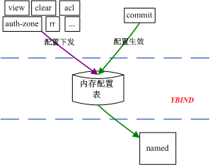

* [发布说明](#发布说明)
* [项目说明](#项目说明)
* [支持的接口](#支持的接口)
* [限制](#限制)
* [校验](#校验)
* [Q&A](#Q&A)
* [ToDos](#ToDos)

------------


# 发布说明
该系列为第一阶段版本，主要涉及的功能有`commit`、`clear`、`export`、`acl`、`view`、`auth-zone`、`forward-zone`、`hint-zone`、`static-stub-zone`、`rr`这些大的接口以及`recursion`、`allow-query`、`allow-query-on`等小接口。它们基本覆盖了DDI产品的主要功能点。
工作流程如下所示：


* 网管调用`view`、`acl`等配置接口下发配置
* **YBIND**通过简单的校验，通过后将配置写入内存中
* 网管调用`commit`接口目的是想让配置生效到**BIND**中
* **YBIND**将内存中的配置格式化到**BIND**配置文件中(`named.conf`、`xxx.zone`)，并重启**BIND**

# 项目说明
由于目前Docker环境还没有完善，暂时发布以rpm方式。

rpm命名方式：
`ybind-版本号-分支_commit号.arch.rpm`

安装方法：
`rpm -ivh ybind-版本号-分支_commit号.arch.rpm`

rpm获取链接：

* [ftp://192.168.8.253/RecursPro/ybind-v1.0.5-yBind_c3d5ce.el6.x86_64.rpm](ftp://192.168.8.253/RecursPro/ybind-v1.0.5-yBind_c3d5ce.el6.x86_64.rpm "ftp://192.168.8.253/RecursPro/ybind-v1.0.5-yBind_c3d5ce.el6.x86_64.rpm")

rpm包中主要包含(因为是纯静态编译，所以不依赖任何动态库)：
```
/etc/init.d/ybindd #开机启动脚本
/usr/bin/killall #用来重启named的工具
/usr/bin/ybind #YBIND执行档
/var/ybind/bind.yml #YBIND默认配置文件
```

**YBIND**支持的命令行参数：

```
Usage of ./build/linux/ybind:
  -c string
        Bind config file(default is './bind.yml') (default "./bind.yml")
  -h    Help
  -p uint
        Http port(default is '9000') (default 9000)
  -v    Show version
```

安装好后启动命令(启动在前台，同时会自动启动named进程)：
```
ybind -c /var/ybind/bind.yml
```

`bind.yml`文件是启动named进程时的默认配置，**YBIND**通过该文件生成了初始的`named.conf`，该文件默认为：

```
options:
  recursion: true
view:
  __default
```

# 支持的接口

| URL                                                          | 方法                   |
| ------------------------------------------------------------ | ---------------------- |
| /api/ybind/v1.0/commit                                       | POST                   |
| /api/ybind/v1.0/export                                       | GET                    |
| /api/ybind/v1.0/clear                                        | POST                   |
| [/api/ybind/v1.0/acl](安全/acl.md)                           | GET、PUT、POST、DELETE |
| [/api/ybind/v1.0/view](视图/view.md)                         | GET、PUT、POST、DELETE |
| [/api/ybind/v1.0/auth-zone](视图/auth-zone.md)               | GET、PUT、POST、DELETE |
| [/api/ybind/v1.0/hint-zone](视图/hint-zone.md)               | GET、PUT、POST、DELETE |
| [/api/ybind/v1.0/static-stub-zone](视图/static-stub-zone.md) | GET、PUT、POST、DELETE |
| [/api/ybind/v1.0/forward-zone](视图/forward-zone.md)         | GET、PUT、POST、DELETE |
| [/api/ybind/v1.0/rr](视图/rr.md)                             | GET、PUT               |
| [/api/ybind/v1.0/match-clients](视图/view-match.md)          | GET、PUT               |
| [/api/ybind/v1.0/match-destinations](视图/view-match.md)     | GET、PUT               |
| [/api/ybind/v1.0/match-recursive-only](视图/view-match.md)   | GET、PUT               |
| [/api/ybind/v1.0/match-domains](视图/view-match.md)          | GET、PUT               |
| [/api/ybind/v1.0/match-ecs-first](视图/ecs.md)               | GET、PUT               |
| [/api/ybind/v1.0/allow-query](视图/allow-query.md)           | GET、PUT               |
| [/api/ybind/v1.0/allow-query-on](视图/allow-query-on.md)     | GET、PUT               |
| [/api/ybind/v1.0/recursion](视图/recursion.md)               | GET、PUT               |
| [/api/ybind/v1.0/allow-transfer](视图/allow-transfer.md)     | GET、PUT               |
| [/api/ybind/v1.0/allow-update](视图/allow-update.md)         | GET、PUT               |
| [/api/ybind/v1.0/allow-notify](视图/allow-notify.md)         | GET、PUT               |
| [/api/ybind/v1.0/masters](视图/masters.md)                   | GET、PUT               |
| [/api/ybind/v1.0/forwarders](视图/forwarders.md)             | GET、PUT               |
| /api/ybind/v1.0/server-addresses                             | GET、PUT               |
| /api/ybind/v1.0/server-names                                 | GET、PUT               |
| [/api/ybind/v1.0/forward](视图/forward.md)                   | GET、PUT               |
| /api/ybind/v1.0/query-source                                 | GET、PUT               |
| /api/ybind/v1.0/query-source-v6                              | GET、PUT               |

# 限制
* 在原始bind环境下运行**YBIND**的时候，不要使用原有bind不支持的配置项(不填即可)，否则每次commit必定失败，这些配置项可能包含下面内容：
	* `match-domains`
	* `match-ecs-first`
	* `rr`记录中的`order`和`weight`
	* `forward`中的`algo`
	* `forwarders`中的`weight`和`order`

# 数据结构

源文件：`ybind/model/type.go`

```go
//总配置
type BindConf struct {
	Acl
	Options
	View
	Logging
	Controls
    TsgiKey
	StatisticsChannels  `yaml:"statistics-channels"`
	LogLevel uint `yaml:"loglevel"`
}

//所有acl策略，acl名字为key是一个字典，它的上一级为BindConf
type Acl map[AclName]Allow

//allow-xxx系列值，它是一个ip地址、ip地址段、acl引用的列表，可以被acl、option策略等作值使用
type Allow []YaddressMatchElement

//所有的option策略，可以放在全局options也可以放在视图里面，option名字为key是一个字典，值为空接口(可能是任意格式的值)，它的上一级为BindConf、View
type Options map[OptionName]interface{}

//所有view策略，view名字为key，值为Options是一个字典，它的上一级为BindConf
type View map[ViewName]Options

//所有zone策略，zone名字为key是一个字典，值为zone里面的选项，它的上一级为View
type Zone map[Domain]ZoneOptions

//一个zone的所有策略，zone option的名字为key是一个字典，值为空接口(可能是任意格式的值)，它的上一级为Zone
type ZoneOptions map[ZoneOptionName]interface{}

//一个zone的所有记录，主机名为key是一个字典，值为该主机名下所有的记录，它的上一级为ZoneOptions
type RR map[Domain]RRDomain

//一个domain的所有记录，类型为key是一个字典，值为该类型下的所有的记录，它的上一级为RR
type RRDomain map[Qtype]RRItems

//一个类型下的所有记录，里面是其ttl、rdata等属性值是一个列表，它的上一级为RRDomain
type RRItems []RRItem

//一条记录的属性值，是一个结构体，它的上一级为RRItems
type RRItem struct {
	TTL    TTL    `json:"ttl,omitempty"`
	Weight Weight `json:"weight,omitempty"`
	Order  Order  `json:"order,omitempty"`
	Rdata  Rdata  `json:"rdata,omitempty"`
}

//转发模式和算法，是一个结构体，它的上一级为ZoneOptions
type Forward struct {
	Mode ForwardMode `json:"mode,omitempty"`
	Algo ForwardAlgo `json:"algo,omitempty"`
}

//转发目标下的所有地址，是一个列表，它的上一级为ZoneOptions
type Forwarders []ForwardersItem

//转发目标地址属性，是一个结构体，它的上一级为Forwarders
type ForwardersItem struct {
	Ip     IP     `json:"ip,omitempty"`
	Weight Weight `json:"weight,omitempty"`
	Order  Order  `json:"order,omitempty"`
}

//指定了目标ip地址列表，一般用在静态存根(static-stub)域中，它的上一级为ZoneOptions
type ServerAddresses []IP

//指定了目标domain列表，一般用在静态存根(static-stub)域中，它的上一级为ZoneOptions
type ServerNames []Domain

//指定了日志属性
type Logging struct{
    Category
    Channel
}

type Category map[CategoryName]CategoryAllow
type CategoryAllow []ChannelName

type Channel map[ChannelName]ChannelOptions
type ChannelOptions map[ChannelOptionName]interface{}

type Controls map[string]interface{}

// statistics channel 配置
type StatisticsChannels struct {
	Inet string 	`json:"inet"`
	Port uint16		`json:"port"`
	Allow []string	`json:"allow"`
}

type Domain string
type Qtype string
type TTL int
type Weight int
type Order int
type Rdata string
type ForwardMode string
type ForwardAlgo string
type IP string
type YaddressMatchElement string
type ZoneType string
type ViewName string
type AclName string
type OptionName string
type ZoneOptionName string
type ChannelName string
type CategoryName string
type ChannelOptionName string
```

一个view的MOCK数据：
```
{
    "recursion": true,
    "allow-query": [
        "1.1.1.1",
        "192/24",
        "localhost"
    ],
    "allow-query-on": [
        "any"
    ],
    "match-clients":[
        "localhost"
    ],
    "match-destinations":[
        "any"
    ],
    "match-recursive-only": false,
    "match-domains": [
        "yamu.com"
    ],
    "match-ecs-first": true,
    "query-source": [
        "192.168.5.41"
    ],
    "query-source-v6": [
        "2001::1"
    ],
    "zone":{
        "yamu.com":{
            "type": "master",
            "allow-query": [
                "any"
            ],
            "allow-query-on": [
                "any"
            ],
            "allow-update":[
                "none"
            ],
            "allow-transfer":[
                "none"
            ],
            "rr":{
                "@":{
                    "SOA":[
                        {
                            "ttl": 86400,
                            "rdata": "dns.yamu.com. admin.yamu.com. 1053891164 2M 1M 1W 1D"
                        }
                    ],
                    "NS":[
                        {
                            "ttl": 86400,
                            "rdata": "dns1"
                        },{
                            "rdata": "dns2"
                        }
                    ]
                },
                "dns1":{
                    "A":[
                        {
                            "ttl": 1090,
                            "rdata": "1.1.1.1"
                        },{
                            "rdata": "2.2.2.2"
                        }
                    ],
                    "AAAA":[
                        {
                            "rdata": "2001::1"
                        }
                    ]
                },
                "dns2":{
                    "AAAA":[
                        {
                            "rdata": "2001::2"
                        }
                    ]
                },
                "c":{
                    "CNAME":[
                        {
                            "rdata": "dns1"
                        }
                    ]
                },
                "m":{
                    "MX":[
                        {
                            "rdata": "10 dns1"
                        }
                    ]
                }
            }
        },
        "google.com":{
            "type": "slave",
            "allow-query": [
                "any"
            ],
            "allow-query-on": [
                "any"
            ],
            "allow-notify":[
                "none"
            ],
            "allow-transfer":[
                "none"
            ],
            "masters":[
                "8.8.8.8"
            ]
        },
        ".":{
            "type": "hint",
            "rr":{
                "@":{
                    "NS":[
                        {
                            "rdata": "A.ROOT-SERVERS.NET."
                        },{
                            "rdata": "B.ROOT-SERVERS.NET."
                        }
                    ]
                },
                "A.ROOT-SERVERS.NET.":{
                    "A":[
                        {
                            "rdata": "198.41.0.4"
                        }
                    ],
                    "AAAA":[
                        {
                            "rdata": "2001:503:ba3e::2:30"
                        }
                    ]
                },
                "B.ROOT-SERVERS.NET.":{
                    "A":[
                        {
                            "rdata": "192.228.79.201"
                        }
                    ]
                }
            }
        },
        "baidu.com":{
            "type": "forward",
            "forward":{
                "mode": "only",
                "algo": "srtt"
            },
            "forwarders":[
                {
                    "ip": "114.114.114.114"
                }
            ]
        },
        "youtube.com":{
            "type": "static-stub",
            "allow-query": [
                "any"
            ],
            "allow-query-on": [
                "any"
            ],
            "server-addresses":[
                "1.1.8.8",
                "2001::8"
            ],
            "server-names":[
                "dns.google.com"
            ]
        }
    }
}
```

# 校验
## 业务逻辑
* 全局`options`下支持的配置项：
```
"recursion"
"allow-query"
"allow-query-on"
"match-clients"
"match-destinations"
"match-recursive-only"
"match-domains"
"match-ecs-first"
"query-source-v6"
"query-source"
```
* `view`下支持的配置项：
```
"zone"
"recursion"
"allow-query"
"allow-query-on"
"match-clients"
"match-destinations"
"match-recursive-only"
"match-domains"
"match-ecs-first"
"query-source-v6"
"query-source"
```
* `rr`支持的类型：
```
"A"
"a"
"AAAA"
"aaaa"
"SOA"
"soa"
"NS"
"ns"
"CNAME"
"cname"
"DNAME"
"dname"
"PTR"
"ptr"
"MX"
"mx"
```
* `zone` `type`支持的值：
```
"master"
"primary"
"slave"
"secondary"
"hint"
"forward"
"static-stub"
```
* `forward` `mode`支持的值：
```
"first"
"only"
```
* `forward` `algo`支持的值：
```
"srtt"
"weight"
"order"
```
* master zone支持的配置项：

| 配置项           | 是否必选 |
| ---------------- | -------- |
| "type"           | 是       |
| "allow-query"    | 否       |
| "allow-query-on" | 否       |
| "allow-transfer" | 否       |
| "allow-update"   | 否       |
| "rr"             | 是       |

其中"rr"记录中必须有一个"soa"

* slave zone支持的配置项：

| 配置项           | 是否必选 |
| ---------------- | -------- |
| "type"           | 是       |
| "allow-query"    | 否       |
| "allow-query-on" | 否       |
| "allow-transfer" | 否       |
| "allow-notify"   | 否       |
| "masters"        | 是       |

* hint zone支持的配置项：

| 配置项 | 是否必选 |
| ------ | -------- |
| "type" | 是       |
| "rr"   | 是       |

* forward zone支持的配置项：

| 配置项       | 是否必选 |
| ------------ | -------- |
| "type"       | 是       |
| "forward"    | 是       |
| "forwarders" | 是       |

* static-stub zone支持的配置项：

| 配置项             | 是否必选 |
| ------------------ | -------- |
| "type"             | 是       |
| "allow-query"      | 否       |
| "allow-query-on"   | 否       |
| "server-addresses" | 否       |
| "server-names"     | 否       |

## 错误码可能对应的错误

* 1 Bad Parameter Format
	
* POST acl时没有传body或者body部分不是Allow类型或者传了一个空的Allow
	
* 2 Bad Parameter Value
	
	* queryString传参为空。
	
	  `GET /api/ybind/v1.0/view?name= `
	
	* body为列表时存在重复的值
	```
	["1.1.1.1", "2/24", "2/24"]
	["1.1.1.1", "localhost ", "   localhost   "]
	```
* PUT acl时body部分的格式错误，既不是Acl也不是Allow格式
	* PUT acl时没有在queryString传name
	* POST/PUT auth-zone时多了option rr
	
* 4 Miss Required Parameter
	* POST acl时没有在queryString中传递name参数
	* POST/PUT auth-zone时缺少必选option rr

* 404 Not Found
	* GET一个不存在的acl
	* PUT一个不存在的acl(PUT返回404一般只在大接口里面，因为大接口有完备的GET、POST、PUT、DELETE方法，新增只能用GET)

* 409 Conflict
	
* POST一个存在的acl(POST返回409一般只在大接口里面，因为大接口有完备的GET、POST、PUT、DELETE方法，修改只能用PUT)
	
* 500 Internal Server Error
	
	* commit 时named报错

# Q&A

# ToDos
- [ ] DELETE 删除不存在的数据时候，回复404
- [ ] 格式错误的时候返回1(包括body中的具体某个option)，值错误才返回2
- [ ] 提示域(hint)配置非根域会被bind忽略(只是个警告)，但并不会报错，实际上并不生效，**YBIND**校验的时候可以加入业务校验使其报错
- [x] bind 9.16迭代行为改动，造成了一些非正常的使用场景(比如根hint域写入yamu.com的授权地址，客户端dig xxx.yamu.com时候，根hint将直接回复结果)被强制使用dnssec，默认配置中如果不把dnssec开关(dnssec-enable no;)和dnssec校验开关(dnssec-validation no;)关闭，将造成业务访问失败
- [ ] zone区域/域名，由数字、字母、下划线（_）、中线（-）和点（.）组成。区域名称由1-63个label组成，每个label由数字、字母、下划线、中线组成，label间以点做分隔。label不能为空，不能由单独的下划线或中线组成，每个label的长度不能超过63个字符。区域名称的总长度不能超过255个字符。ipv4反向域以in-addr.arpa结尾，前面可有1-4个label，label的内容为0-255。ipv6反向域以ip6.arpa结尾，前面可有1-32个label，label的内容为0-f。字母不区分大小写，统一以小写字母入库。
- [ ] 从rpm中拿掉killall 使用原生的kill取代，避免安装冲突
- [ ] 将named运行目录统一到/var/ybind/下面，无需手动cd /var/ybind/  再执行ybind
- [ ]  提示域（hint）新增 NS,A,AAAA记录时，body中记录为空时，可以新增成功，例如：”NS”:[]，body中记录为空时，保留{}，会报错，例如：”NS”:[{}]，