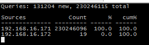
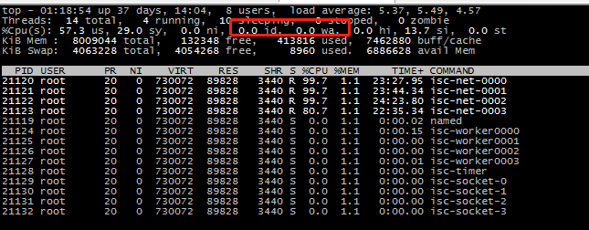
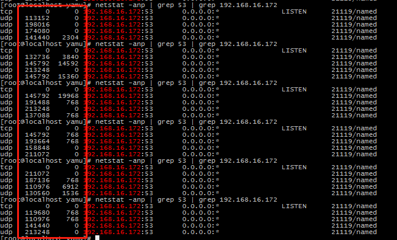

# 环境

| 模块          | 服务器    | 客户端 |
| :------------ | :------ | :----- |
| IP       | 192.168.16.172     | 192.168.16.171   |
| centos       | `CentOS Linux release 7.7.1908 (Core)`     | `CentOS Linux release 7.7.1908 (Core)`   |
| cpu       | `Intel(R) Xeon(R) CPU E5-2620 v2 @ 2.10GHz`, 4线程     | `Intel(R) Xeon(R) CPU E5-2620 v2 @ 2.10GHz`, 4线程   |
| 内核       | `3.10.0-1062.el7.x86_64`，支持`reuseport`     | `3.10.0-1062.el7.x86_64`，支持`reuseport`   |
| 网卡       | 万兆全双工     | 万兆全双工   |
| 内存       | 8G     | 8G   |
| bind       | `9.16.6`, 仓库 https://github.com/isc-projects/bind9, tag v9_16_6, 8月10号稳定版     | -   |


# 测试工具

| 工具          | 描述    |
| :------------ | :------ |
| dnsperf       | dns压测工具，也可以使用`bind`自带的`queryperf`工具     |
| dnstop  | dns多维度top分析工具，用来查看实时 qps aps  |
| perf  | 用来分析`bind`运行cpu信息  |
| FlameGraph  | 生成火焰图  |
| netstat  | 查看socket 队列信息  |
| top  | 查看cpu信息，支持多线程  |


# 配置
`named.conf`:
```
key "rndc-key" {
        algorithm hmac-sha256;
        secret "BVWL+RjTlME3N9JJtDFBOfCgvNlQwYob42tkokhMMZ0=";
};
controls {
    inet 127.0.0.1 port 953
        allow{  127.0.0.1;} keys{  rndc-key;};
};
statistics-channels {
    inet * port 9001
        allow {any;};
};
    acl acl2 { 1.1.1.1; 1.1.2.0/24;};
options {
    allow-query { any;};
    recursion yes;
    dnssec-validation no;
    directory "/var/bind/";
    dump-file "/var/bind/named_dump.db";
};
view __default {
    nxdomain-redirect nxdomain-list;
    response-policy{
        zone "rpz-list";
    } qname-wait-recurse no;
    zone nxdomain-list {
    type master;
    file "/var/bind/__default_nxdomain-list.zone";
    };
    zone rpz-list {
    file "/var/bind/__default_rpz-list.zone";
    type master;
    };
    zone hyperdns.com {
        file "/var/bind/hyperdns.com";
        type master; 
    };
};
```
`hyperdns.com`:
```
$TTL 86400
@       86400   IN      SOA     ns admin 2008050001 900 600 86400 3600 
@       3600    IN      NS      ns
ns      3600    IN      A       127.0.0.1
admin   3600    IN      A       127.0.0.1
www     3600    IN      A       7.7.7.7
```


# 测试简要步骤
在`192.168.16.171`上开启4个`dnsperf`向`192.168.16.172`打域名`www.hyperdns.com`，这时候`192.168.16.172`上的`bind`已经占满了cpu，已经达到了极限。


# 现象
## qps
13万 qps



## cpu
cpu达到瓶颈，I/O未达到瓶颈



## socket 
recv-Q长期滞留100-200K(大概每个核滞留了1k的qps，该现象从`192.168.16.171`上也可以看出来，因为`dnsperf`已经偶尔开始丢包了)<br>
send-Q基本无滞留(有消息就会被立马消费)



## 火焰图
集合所有的系统调用包括收发包等所有陷入内核的操作总计占用15%-20%左右，剩下的占用应该在dns业务方面


# 总结
* 4线程，纯授权最理想的qps应该在13万上下
* 4线程，`bind`的瓶颈出现在`cpu`，其中占用较多的在处理业务方面
* 猜想：在多授权域，多记录，压测域名多样的情况下，`bind`的性能将更低，业务处理方面更加劣势
